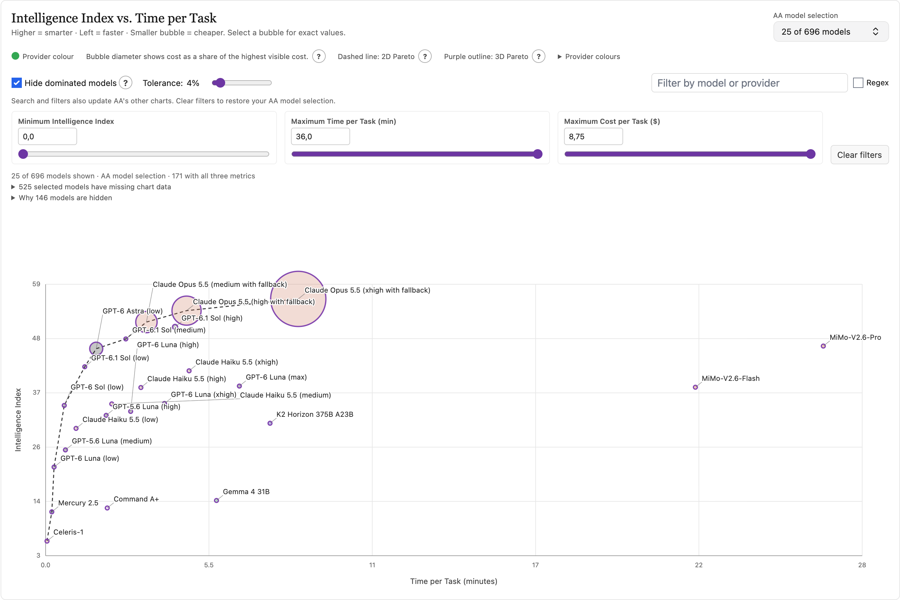

# Artificial Analysis: Intelligence, Time, and Cost bubbles

**Artificial Analysis lists more than 600 models.** A model can be smart but slow or costly. Checking intelligence, time, and cost across separate charts makes it hard to find a good choice.

**Hide weaker choices automatically.** Turn on **Hide dominated models** to hide each selected model that has an alternative at least as smart, fast, and cheap, and better on one measure. Set tolerance to 0% for exact comparisons. Higher values also hide near matches.

This Tampermonkey script brings all three measures into one bubble chart on the [homepage](https://artificialanalysis.ai/) and [models page](https://artificialanalysis.ai/models). The chart appears before the site's own charts. Higher bubbles are smarter, bubbles farther left are faster, and smaller bubbles are cheaper. Select a bubble to see exact values.

**[Install from Greasy Fork](https://greasyfork.org/en/scripts/597690-artificial-analysis-intelligence-time-cost-bubbles)** · **[Chrome installation guide](CHROME-INSTALLATION.md)** · **[GitHub script file](artificial-analysis-3d-bubble.user.js)**

## What you can do

- Set a minimum Intelligence Index and maximum time and cost with sliders or exact number fields. The chart updates while you move a slider.
- Search by model or provider name. The search and filters also update AA's model selection in its other charts.
- Open the same AA model picker from the custom chart.
- Show a dashed two-dimensional Pareto line and purple outlines for the exact three-dimensional Pareto set. Click the `?` buttons in the chart for explanations.
- Hide dominated or nearly dominated models. At 0% tolerance, the comparison is exact. Open “Why models are hidden” to see the model and values behind each decision.
- See which selected models have missing Intelligence Index, time, or cost data.
- Select a bubble for exact values. Bubble targets support touch, mouse, and keyboard. On a phone, swipe the chart or use its left and right buttons.

Settings are saved in this browser's `localStorage` and restored after a page reload. The “Clear filters” button restores the AA model selection you had before filtering.

## Data and limits

The script reads data from the open AA page. A model needs all three metrics to appear in the bubble chart. AA can change its page structure or data format, which may require a script update. Bubble sizes use a compressed scale for readability; select a bubble to see the exact cost.

The script does not send data to another server. Tampermonkey checks the source used for installation for updates: Greasy Fork for Greasy Fork installs, or GitHub for direct GitHub installs. This is an independent addition and is not an official Artificial Analysis feature.

## Files

- [`artificial-analysis-3d-bubble.user.js`](artificial-analysis-3d-bubble.user.js) — installable userscript.
- [`CHROME-INSTALLATION.md`](CHROME-INSTALLATION.md) — step-by-step Chrome guide.

Report problems on [GitHub Issues](https://github.com/henno/artificial-analysis-bubble-chart/issues).
